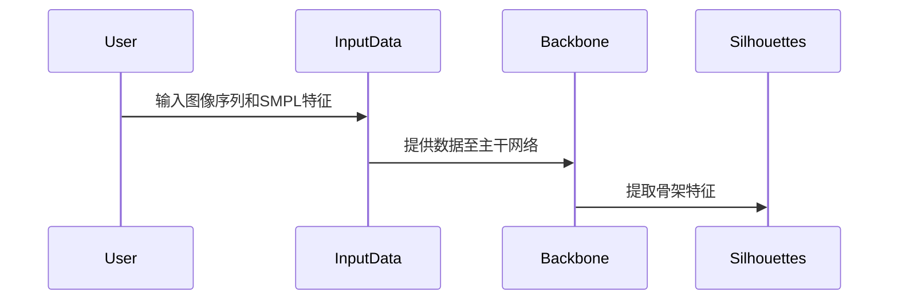
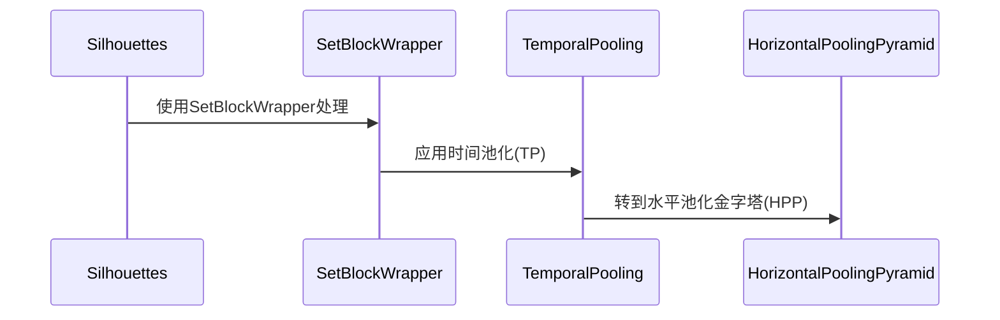
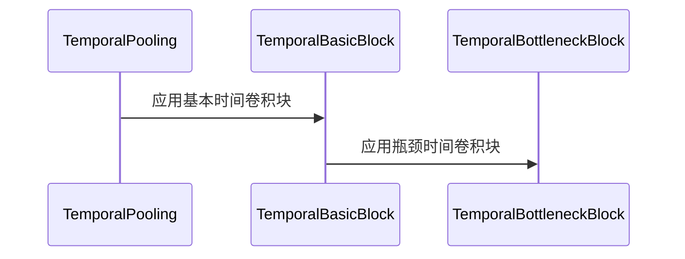
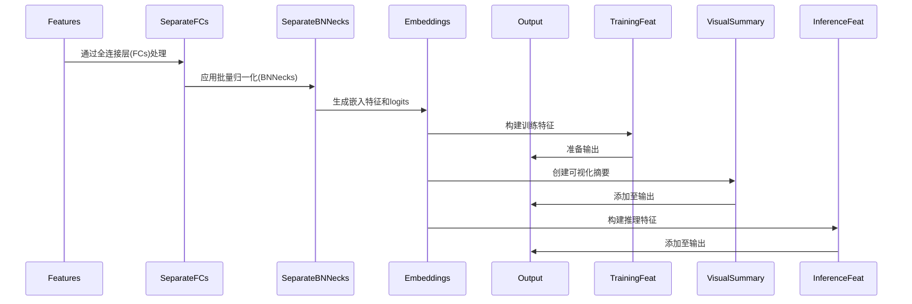
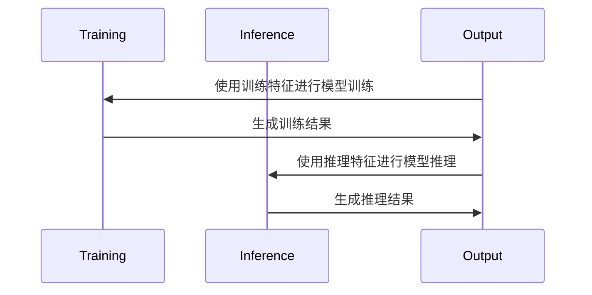
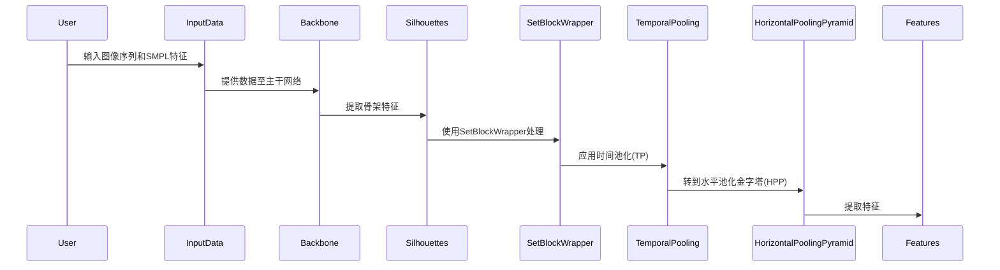
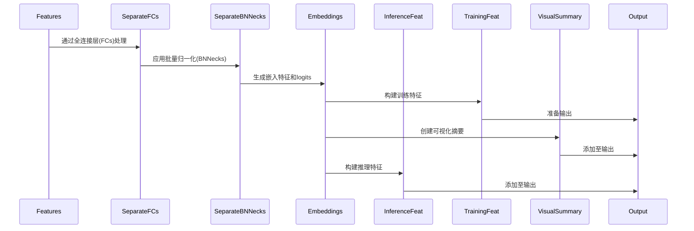

## 架构

### Step 1: Data Input and Preprocessing
- **Motivation**: The initial phase is critical for structuring raw data into a format amenable to machine learning. Preprocessing ensures that the input images and SMPL features are standardized, facilitating the subsequent feature extraction by the backbone network.

### Step 2: Skeleton Feature Processing
- **Motivation**: Skeleton features are pivotal for interpreting the posture and shape of subjects within images. Processing these features with a SetBlockWrapper prepares them for temporal analysis, which is essential for understanding motion dynamics.

### Step 3: Temporal Convolutional Module
- **Motivation**: This module is designed to capture temporal dependencies within image sequences. By applying basic and bottleneck convolutional blocks, the model can discern patterns over time, which is fundamental for recognizing movement and action sequences.

### Step 4: Feature Transformation and Output Generation
- **Motivation**: Feature transformation is the process of converting raw data into a form that can be more effectively learned by the model. Through fully connected layers and batch normalization, the model generates embedding features and logits, which are crucial for classification or regression tasks. Additionally, creating visualization summaries and inference features aids in model evaluation and interpretation of decision-making processes.

### Step 5: Model Training and Inference
- **Motivation**: Training and inference are the culminating stages of a machine learning model's lifecycle. The training phase optimizes model parameters using training features, while the inference phase applies these parameters to predict outcomes for new data. These stages are indispensable for the practical application and deployment of the model.

## 架构图

### 步骤1：数据输入和预处理



### 步骤2：骨架特征处理



### 步骤3：时间卷积模块



### 步骤4：特征转换和输出生成



### 步骤5：模型训练和推理



### 输入处理和特征提取



### 特征处理和输出生成




## 模块具体
### SeparateFCs

- SeparateFCs模块是一个全连接层，它被设计为处理一个“部分”或“bin”的集合，其中每个部分独立地进行特征变换。这种设计允许模型独立地学习每个部分的特征表示，可能有助于捕获更细粒度的特征。

    - __init__方法初始化模块，创建一个可学习的参数fc_bin，这个参数是一个张量，其形状为(parts_num, in_channels, out_channels)，并且使用Xavier初始化方法。
    - forward方法接受一个三维张量x作为输入，形状为[n, c_in, p]，表示批次大小、输入通道数和部分数。该方法将输入张量x的维度重新排列，并与fc_bin进行矩阵乘法。如果设置了norm，则在乘法之前对fc_bin进行归一化。

### SeparateBNNecks

- SeparateBNNecks模块结合了批量归一化和全连接层，用于生成每个输入部分的特征和分类logits。

    - __init__方法初始化批量归一化层，可以是并行的一维批量归一化层或多个独立的批量归一化层。
    - forward方法首先应用批量归一化，然后将归一化后的特征通过一个转置操作，并通过一个全连接层（fc_bin）生成特征和logits。如果设置了norm，则在矩阵乘法之前对特征和fc_bin进行归一化。

### TemporalBasicBlock

- TemporalBasicBlock是一个时间卷积残差块，它主要用于处理时间序列数据，如骨架关键点数据。这个块的设计灵感来源于残差网络（ResNet），它通过引入残差连接来帮助训练更深的网络。

    - __init__方法初始化块，接受输入通道数channels、时间窗口大小temporal_window_size、步长stride等参数。
    - padding是根据时间窗口大小自动计算的，用于在时间维度上对输入数据进行填充，以保持数据的维度不变。
    - self.residual是一个lambda函数或nn.Sequential，用于实现残差连接。如果步长stride为1，残差连接就是直接通过输入；如果步长为2，会使用1x1的卷积层和批量归一化层来实现残差连接。
    - self.conv是一个时间卷积层，用于在时间维度上提取特征。
    - self.bn是批量归一化层，用于规范化self.conv的输出。
    - self.relu是ReLU激活函数。

- forward方法实现了块的前向传播。它首先计算残差连接res_block，然后将输入数据通过时间卷积层、批量归一化层和ReLU激活函数，最后将残差连接和时间卷积块的输出相加并再次通过ReLU激活函数。

### TemporalBottleneckBlock

- TemporalBottleneckBlock是TemporalBasicBlock的瓶颈版本，它通过引入1x1的卷积层来减少模型的参数数量和计算量，同时保持了模型的性能。

    - __init__方法同样初始化块，但增加了reduction参数，用于控制中间通道数inter_channels。
    - self.conv_down是一个1x1的卷积层，用于将输入通道数减少到inter_channels。
    - self.bn_down是对应于self.conv_down的批量归一化层。
    - self.conv和self.bn与TemporalBasicBlock中的相同，但在瓶颈块中，它们作用于中间通道数inter_channels。
    - self.conv_up是一个1x1的卷积层，用于将中间通道数inter_channels增加回原始通道数channels。
    - self.bn_up是对应于self.conv_up的批量归一化层。

- forward方法的实现与TemporalBasicBlock类似，但增加了一个中间步骤，即通过self.conv_down和self.conv_up进行通道数的降低和恢复。


## 具体实现

```python
Modifed from https://github.com/Gait3D/Gait3D-Benchmark/blob/72beab994c137b902d826f4b9f9e95b107bebd78/lib/modeling/models/smplgait.py   

# 导入PyTorch库
import torch
# 导入PyTorch的神经网络模块
import torch.nn as nn
# 导入PyTorch的函数库，用于激活函数等操作
import torch.nn.functional as F
# 导入自动求导包
from torch.autograd import Variable

# 从同一包中的base_model模块导入基类BaseModel
from ..base_model import BaseModel
# 从同一包中的modules模块导入自定义模块
from ..modules import SetBlockWrapper, HorizontalPoolingPyramid, PackSequenceWrapper, SeparateFCs, SeparateBNNecks

# 定义SMPLGait类，继承自BaseModel
class SMPLGait(BaseModel):
    # 构造函数，初始化SMPLGait模型
    def __init__(self, cfgs, is_training):
        # 调用基类的构造函数
        super().__init__(cfgs, is_training)

    # 构建网络结构的方法
    def build_network(self, model_cfg):
        # 获取模型的主干网络，并用SetBlockWrapper包装
        self.Backbone = self.get_backbone(model_cfg['backbone_cfg'])
        self.Backbone = SetBlockWrapper(self.Backbone)
        # 创建分离的全连接层
        self.FCs = SeparateFCs(**model_cfg['SeparateFCs'])
        # 创建分离的批量归一化层
        self.BNNecks = SeparateBNNecks(**model_cfg['SeparateBNNecks'])
        # 创建打包序列的包装器
        self.TP = PackSequenceWrapper(torch.max)
        # 创建水平池化金字塔
        self.HPP = HorizontalPoolingPyramid(bin_num=model_cfg['bin_num'])

        # 定义SMPL的全连接层
        self.fc1 = nn.Linear(85, 128)
        self.fc2 = nn.Linear(128, 256)
        self.fc3 = nn.Linear(256, 256)
        # 定义批量归一化层
        self.bn1 = nn.BatchNorm1d(128)
        self.bn2 = nn.BatchNorm1d(256)
        self.bn3 = nn.BatchNorm1d(256)
        # 定义Dropout层以减少过拟合
        self.dropout2 = nn.Dropout(p=0.2)
        self.dropout3 = nn.Dropout(p=0.2)

    # 模型的前向传播函数
    def forward(self, inputs):
        # 解包输入数据，包括图像序列和标签
        ipts, labs, _, _, seqL = inputs

        # 提取图像序列和SMPL数据
        sils = ipts[0]    # [n, s, h, w]
        smpls = ipts[1]   # [n, s, d]

        # 将SMPL数据展平成一维
        n, s, d = smpls.size()
        sps = smpls.view(-1, d)
        # 不再需要smpls，删除以节省内存
        del smpls

        # 通过全连接层和批量归一化提取SMPL特征
        sps = F.relu(self.bn1(self.fc1(sps)))
        sps = F.relu(self.bn2(self.dropout2(self.fc2(sps))))  # (B, 256)
        sps = F.relu(self.bn3(self.dropout3(self.fc3(sps))))  # (B, 256)
        # 将特征重塑为与输入图像序列匹配的形状
        sps = sps.reshape(n, 1, s, 16, 16)
        # 创建单位矩阵并扩展以匹配特征维度
        iden = Variable(torch.eye(16)).unsqueeze(
            0).repeat(n, 1, s, 1, 1)   # [n, 1, s, 16, 16]
        # 如果在GPU上运行，则将单位矩阵也转移到GPU
        if sps.is_cuda:
            iden = iden.cuda()
        # 将单位矩阵添加到SMPL特征上
        sps_trans = sps + iden   # [n, 1, s, 16, 16]

        # 如果图像序列维度为4，则增加一个维度以匹配网络输入
        if len(sils.size()) == 4:
            sils = sils.unsqueeze(1)

        # 不再需要ipts，删除以节省内存
        del ipts
        # 通过主干网络提取图像特征
        outs = self.Backbone(sils)  # [n, c, s, h, w]
        # 获取输出特征的维度
        outs_n, outs_c, outs_s, outs_h, outs_w = outs.size()

        # 创建一个零张量用于后续操作
        zero_tensor = Variable(torch.zeros(
            (outs_n, outs_c, outs_s, outs_h, outs_h-outs_w)))
        # 如果在GPU上运行，则将零张量也转移到GPU
        if outs.is_cuda:
            zero_tensor = zero_tensor.cuda()
        # 将零张量与图像特征连接，然后重塑以匹配网络要求的形状
        outs = torch.cat([outs, zero_tensor], -1)
        outs = outs.reshape(outs_n*outs_c*outs_s, outs_h,
                            outs_h)   # [n*c*s, 16, 16]

        # 将SMPL特征扩展以匹配图像特征的通道数，并重塑
        sps = sps_trans.repeat(1, outs_c, 1, 1, 1).reshape(
            outs_n * outs_c * outs_s, 16, 16)

        # 使用批量矩阵乘法将图像特征与SMPL特征结合
        outs_trans = torch.bmm(outs, sps)
        # 重塑结合后的特征以匹配网络要求的形状
        outs_trans = outs_trans.reshape(outs_n, outs_c, outs_s, outs_h, outs_h)

        # 应用时间池化操作
        outs_trans = self.TP(outs_trans, seqL, options={"dim": 2})[
            0]  # [n, c, h, w]
        # 应用水平池化金字塔操作
        feat = self.HPP(outs_trans)  # [n, c, p]
        # 通过全连接层进一步提取特征
        embed_1 = self.FCs(feat)  # [n, c, p]

        # 通过批量归一化层和分类层得到最终的嵌入特征和预测结果
        embed_2, logits = self.BNNecks(embed_1)  # [n, c, p]

        # 获取图像序列的维度
        n, _, s, h, w = sils.size()
        # 构造返回值，包含训练特征、可视化摘要和推理特征
        retval = {
            'training_feat': {
                'triplet': {'embeddings': embed_1, 'labels': labs},
                'softmax': {'logits': logits, 'labels': labs}
            },
            'visual_summary': {
                'image/sils': sils.view(n*s, 1, h, w)
            },
            'inference_feat': {
                'embeddings': embed_1
            }
        }
        # 返回模型的输出结果
        return retval
```